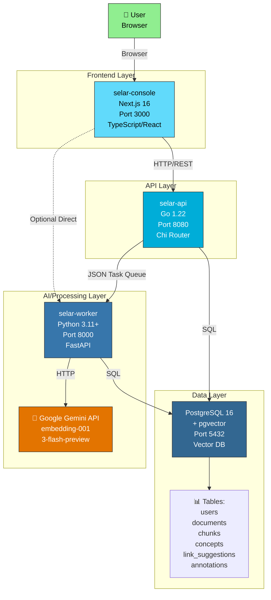
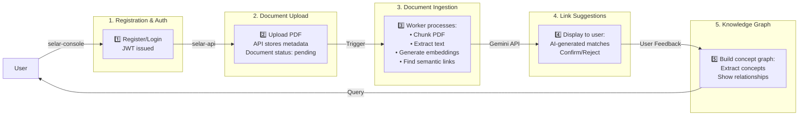
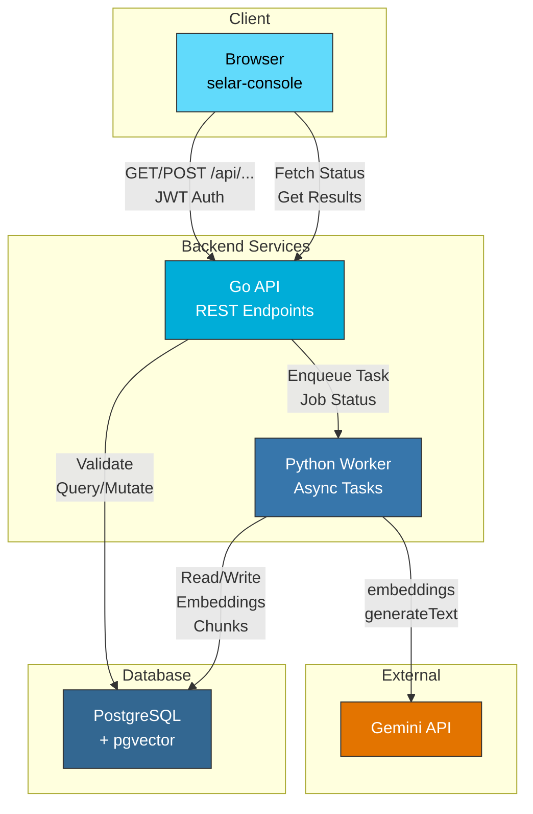

# SELAR Architecture

## System Architecture Diagram

## Data Flow Diagram

## Component Interactions

## Technology Stack Summary

| Layer | Service | Tech | Port | Purpose |
|-------|---------|------|------|---------|
| **Frontend** | selar-console | Next.js 16, TypeScript, React | 3000 | PDF reader, matches UI, graph visualization |
| **API** | selar-api | Go 1.22, Chi router | 8080 | REST API, JWT auth, CRUD, business logic |
| **Worker** | selar-worker | Python 3.11+, FastAPI | 8000 | Document ingestion, chunking, embeddings, link generation |
| **Database** | PostgreSQL | PostgreSQL 16 + pgvector | 5432 | User data, documents, embeddings (3072-dim), concept graph |
| **External** | Gemini API | Google AI Studio | — | Text embeddings & generation |

## Key Features & Flow

1. **User Registration**: JWT-based auth in selar-api
2. **PDF Upload**: Document stored in DB with `status: pending`
3. **Async Processing**: Worker consumes PDF, chunks text, generates embeddings
4. **Semantic Linking**: pgvector similarity search finds related passages
5. **User Feedback**: Confirm/reject suggestions → retrieval-practice event
6. **Knowledge Graph**: Extract & visualize concepts and relationships
