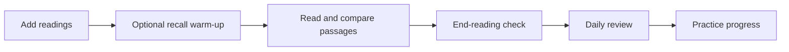

# SELAR
### Semantic Linking for Active Retention

Read across papers and notes, compare suggested connections against their source passages, and ask questions with citations to your library.

**Research prototype — not a proven learning intervention.** AI suggestions can be wrong; features may change or break. Use non-sensitive material you have permission to upload.

[User guide](docs/user-guide.md) · [Local quickstart](docs/local-quickstart.md) · [Deployment](docs/DEPLOYMENT.md) · [Contributing](CONTRIBUTING.md)

*Workflow diagram, not a screenshot or a claim of measured learning gains.*

## Start here

| You want to… | Start with… |
|---|---|
| Use a hosted instance | Open the address supplied by its operator, create an account or sign in, then follow the [first-reading walkthrough](docs/user-guide.md). No developer tools needed. |
| Run SELAR on your computer | Follow the [local quickstart](docs/local-quickstart.md): isolated database, API, worker and console, with a no-model-call smoke check. |
| Operate a hosted deployment | Read the existing [deployment guide](docs/DEPLOYMENT.md); local development settings are not production settings. |

This canonical repository, `kaviru2/selar-dev`, is **private**. Cloning requires repository access; this README does not promise public sign-up or a publicly available hosted service.

## What is available

- **Library:** local PDF uploads, public web articles, and pasted text/Markdown. Optional Google Drive import currently accepts PDFs only.
- **Reader:** optional **Before reading** recall, reflection prompts with **Compare passages** and **This link is wrong**, and an **End-reading check**. No keep/reject decision is required.
- **Review and Progress:** owner-scoped generated practice, separate AI support checking and answer feedback, a conservative review schedule, observed attempt counts and UTC review streaks. These are not validated measures of mastery.
- **Chat and Graph:** ask library-grounded questions, inspect citations, and review concept relationships. A citation is something to check, not proof that an answer is correct.
- **Quizzes and Settings:** operator-assigned quizzes and account controls; availability depends on the instance and account.

### Current boundaries

Native Google Docs export, DOCX, and `.md`/`.txt` **file uploads are not part of this documented baseline**. Pasting Markdown is not full Markdown-file support.

The learning loop is merged into `main` at `ce0ba3c542e3fa0ab1d804033407220d8cf57144`, not necessarily deployed to your instance. Expanded import and lightweight onboarding work remain separate. Opening or flagging reflection prompts creates neither graph assertions nor recall success; historical graph records remain available.

## Prerequisites

Hosted learners need only the supplied instance address and an account. Self-hosters need the tools listed in the [local quickstart](docs/local-quickstart.md#prerequisites). The stack is **Next.js console → Go API → PostgreSQL/pgvector**, with a **Python worker → Google Gemini** for model-backed processing.

## Costs and data

Local registration and an empty library can run without a model key. Document AI processing, generated chat and practice generation/checking/grading use Gemini in the current implementation: cloud requests can consume quota or incur charges, even when SELAR runs locally. There is no verified all-local AI provider path documented here, and no guarantee that a provider's free tier is sufficient.

Your own computer, storage and any hosted database/server services have resource costs. Local hosting is not the same as offline processing: uploaded content may be sent to the configured model provider. See [setup boundaries and costs](docs/local-quickstart.md#costs-and-data-boundary) before adding material.

## Repository documentation

- [User guide](docs/user-guide.md) — supported inputs, reading workflow and troubleshooting.
- [Local quickstart](docs/local-quickstart.md) — tested native setup and explicit verification limits.
- [Deployment](docs/DEPLOYMENT.md) — hosted infrastructure and production configuration.
- [Quizzes](docs/QUIZZES.md), [analytics](docs/ANALYTICS.md), [reminders](docs/REMINDERS.md) — feature and operator details.
- [Research protocol](dev_artifacts/ISSUE_5_RESEARCH_PROTOCOL.md) — hypotheses and evaluation design, not results.

## License

The repository contains the [Apache License 2.0](LICENSE). Repository access and hosted-service access are separate from that license; neither is changed by these docs.
